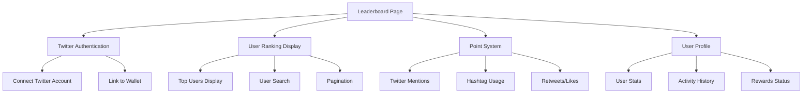
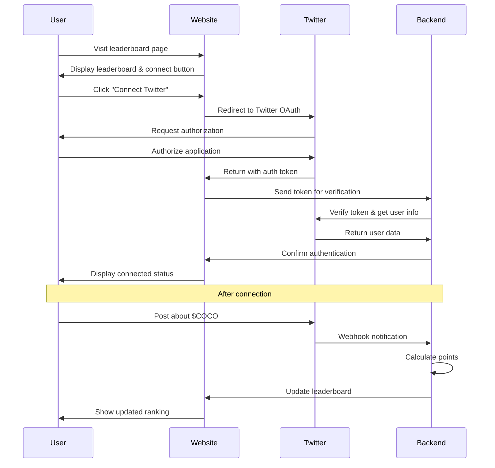
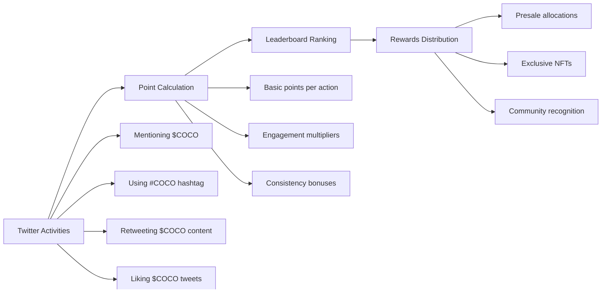
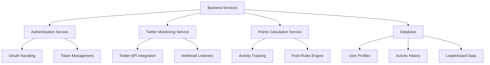
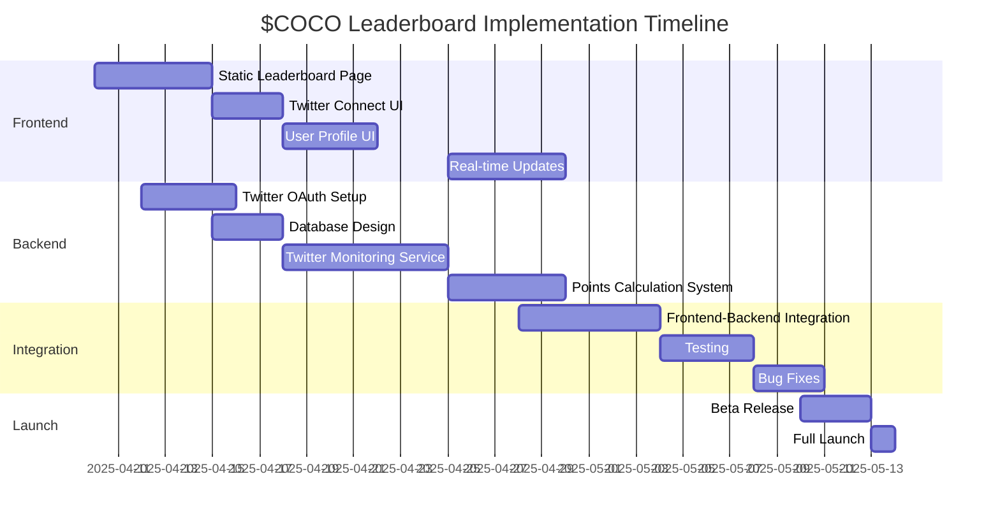

# $COCO Leaderboard Page - Detailed Implementation Plan

Based on analysis of the current website and the example provided (cookavax.com), this document outlines a comprehensive plan for implementing the $COCO leaderboard page. This plan focuses on Twitter integration, tracking user engagement with $COCO, and creating an engaging leaderboard experience.

## 1. Overview and Goals



**Primary Goals:**
- Allow users to connect their Twitter accounts
- Track how much users talk about $COCO on Twitter
- Display a leaderboard ranking users based on their $COCO engagement
- Incentivize community participation and brand awareness

## 2. User Experience Flow



## 3. Page Structure and Design

The leaderboard page will maintain the same visual style as the existing website, using the same color scheme, typography, and overall aesthetic. Here's the proposed structure:

### 3.1 Header Section
- Title: "$COCO Leaderboard"
- Subtitle: "Talk about $COCO, earn rewards!"
- Brief explanation of how the leaderboard works
- Prominent "Connect Your Twitter" button

### 3.2 Leaderboard Display
- Top 3 users highlighted with special styling (similar to cookavax.com)
- Remaining users listed in descending order of points
- Each entry includes:
  - Rank number
  - Twitter profile picture
  - Twitter handle
  - Points earned
  - Twitter verification badge (if applicable)

### 3.3 User Profile Section
- Only visible when user is connected
- Shows user's current rank and points
- Recent activity (last 5 tweets about $COCO)
- Progress toward next reward tier

### 3.4 How It Works Section
- Step-by-step explanation of how to earn points
- Examples of effective tweets
- Information about rewards

## 4. Point System



**Point Allocation:**
- Mentioning $COCO in a tweet: 10 points
- Using #COCO hashtag: 5 points
- Retweeting official $COCO content: 15 points
- Liking official $COCO tweets: 2 points
- Engagement on user's $COCO tweets (likes/retweets): 1 point per engagement
- Consistency bonus: +5 points per day of consecutive activity

## 5. Technical Implementation

### 5.1 Frontend Components

**HTML Structure:**
- Create a new `leaderboard.html` file based on existing page structure
- Implement responsive design for all device sizes
- Include sections for the leaderboard, user profile, and how-it-works

**CSS Styling:**
- Extend existing CSS with leaderboard-specific styles
- Create animations for rank changes and point updates
- Implement responsive design for mobile users

**JavaScript Functionality:**
- Twitter authentication handling
- Leaderboard data fetching and display
- Real-time updates for user activities
- Search and filtering functionality

### 5.2 Backend Requirements



**Key Components:**
1. **Authentication System**
   - Twitter OAuth integration
   - User profile storage
   - Session management

2. **Twitter Monitoring**
   - Twitter API integration to track mentions, hashtags, and engagement
   - Webhook setup for real-time notifications
   - Rate limit handling and fallback mechanisms

3. **Database Structure**
   - Users table (Twitter ID, handle, profile pic, wallet address)
   - Activities table (user ID, activity type, timestamp, points)
   - Leaderboard table (user ID, total points, rank, last updated)

4. **API Endpoints**
   - `/auth/twitter` - Handle Twitter authentication
   - `/api/leaderboard` - Get leaderboard data
   - `/api/user/:id` - Get user profile and stats
   - `/api/activities/:userId` - Get user activities

### 5.3 Twitter API Integration

The Twitter API v2 will be used to:
1. Authenticate users via OAuth 2.0
2. Search for tweets mentioning $COCO
3. Track user engagement with $COCO content
4. Monitor hashtag usage

**Required Twitter API Endpoints:**
- OAuth 2.0 authorization
- Tweet search and filtering
- User profile information
- Tweet engagement metrics

### 5.4 Wallet Integration

To link Twitter accounts with crypto wallets:
1. User connects Twitter account
2. User connects wallet (using existing wallet connection functionality)
3. Backend associates the Twitter ID with the wallet address
4. All future activities from that Twitter account are credited to the linked wallet

## 6. Development Approach

A phased approach to implementation:

### Phase 1: Static Leaderboard
- Create the HTML/CSS for the leaderboard page
- Implement the page design with placeholder data
- Ensure responsive design works on all devices

### Phase 2: Twitter Authentication
- Implement the "Connect Twitter" functionality
- Set up the OAuth flow
- Store user credentials securely

### Phase 3: Backend Integration
- Develop the backend services for tracking Twitter activity
- Implement the points calculation system
- Create the database structure

### Phase 4: Real-time Updates
- Add real-time updates to the leaderboard
- Implement notifications for point changes
- Add user profile and activity history

## 7. Technical Considerations

### 7.1 Twitter API Limitations
- Rate limits: 500,000 tweets/month for standard access
- Search limitations: 7-day lookback period
- Authentication requirements: Developer account and approved app

### 7.2 Security Considerations
- Secure storage of OAuth tokens
- Protection against fake accounts and spam
- Prevention of point manipulation

### 7.3 Scalability
- Efficient database design for quick leaderboard updates
- Caching strategies for frequently accessed data
- Batch processing for point calculations

## 8. Implementation Timeline



## 9. Example Code Snippets

To give you an idea of what the implementation will look like, here are some simplified code snippets:

### HTML Structure (leaderboard.html)
```html
<!DOCTYPE html>
<html lang="en">
<head>
    <!-- Same head structure as your existing pages -->
    <title>$COCO Leaderboard - The Pink Ostrich of AVAX</title>
    <link rel="stylesheet" href="css/leaderboard.css">
</head>
<body>
    <!-- Header (same as other pages) -->
    
    <!-- Leaderboard Section -->
    <section id="leaderboard" class="leaderboard-section">
        <div class="container">
            <div class="section-header">
                <h2>$COCO Leaderboard</h2>
                <p>Talk about $COCO, earn rewards!</p>
            </div>
            
            <div class="twitter-connect">
                <p>Connect your Twitter account to start earning points and climb the leaderboard!</p>
                <button id="connect-twitter-btn" class="btn btn-primary btn-large">
                    <i class="fab fa-twitter"></i> Connect Twitter
                </button>
            </div>
            
            <div class="leaderboard-container">
                <div class="top-users">
                    <!-- Top 3 users will be displayed here -->
                </div>
                
                <div class="leaderboard-list">
                    <!-- Rest of the users will be displayed here -->
                </div>
                
                <div class="leaderboard-pagination">
                    <!-- Pagination controls -->
                </div>
            </div>
        </div>
    </section>
    
    <!-- User Profile Section (visible only when connected) -->
    <section id="user-profile" class="user-profile-section hidden">
        <!-- User profile content -->
    </section>
    
    <!-- How It Works Section -->
    <section id="how-it-works" class="how-it-works-section">
        <!-- Explanation of the leaderboard system -->
    </section>
    
    <!-- Footer (same as other pages) -->
    
    <!-- JavaScript -->
    <script src="js/leaderboard.js"></script>
</body>
</html>
```

### JavaScript for Twitter Authentication (simplified)
```javascript
// Twitter authentication handling
document.getElementById('connect-twitter-btn').addEventListener('click', function() {
    // Redirect to backend authentication endpoint
    window.location.href = '/auth/twitter';
});

// Check if user is returning from Twitter OAuth
document.addEventListener('DOMContentLoaded', function() {
    const urlParams = new URLSearchParams(window.location.search);
    const authToken = urlParams.get('oauth_token');
    const authVerifier = urlParams.get('oauth_verifier');
    
    if (authToken && authVerifier) {
        // Complete the authentication process
        fetch('/auth/twitter/callback', {
            method: 'POST',
            headers: {
                'Content-Type': 'application/json'
            },
            body: JSON.stringify({
                oauth_token: authToken,
                oauth_verifier: authVerifier
            })
        })
        .then(response => response.json())
        .then(data => {
            if (data.success) {
                // Show user as connected
                showUserProfile(data.user);
                loadLeaderboard();
            }
        });
    }
});

// Load leaderboard data
function loadLeaderboard() {
    fetch('/api/leaderboard')
        .then(response => response.json())
        .then(data => {
            renderLeaderboard(data);
        });
}

// Render leaderboard with user data
function renderLeaderboard(data) {
    const topUsers = document.querySelector('.top-users');
    const leaderboardList = document.querySelector('.leaderboard-list');
    
    // Clear existing content
    topUsers.innerHTML = '';
    leaderboardList.innerHTML = '';
    
    // Render top 3 users
    data.slice(0, 3).forEach((user, index) => {
        topUsers.innerHTML += `
            <div class="top-user rank-${index + 1}">
                <div class="rank">#${index + 1}</div>
                
                <div class="user-info">
                    <div class="user-handle">@${user.handle}</div>
                    <div class="user-points">${user.points} points</div>
                </div>
            </div>
        `;
    });
    
    // Render remaining users
    data.slice(3).forEach((user, index) => {
        leaderboardList.innerHTML += `
            <div class="leaderboard-item">
                <div class="rank">#${index + 4}</div>
                
                <div class="user-handle">@${user.handle}</div>
                <div class="user-points">${user.points} points</div>
            </div>
        `;
    });
}
```

## 10. Next Steps

1. Begin implementation with the static leaderboard page
2. Set up Twitter Developer Account for API access
3. Implement the frontend components
4. Develop the backend services
5. Integrate and test the complete system