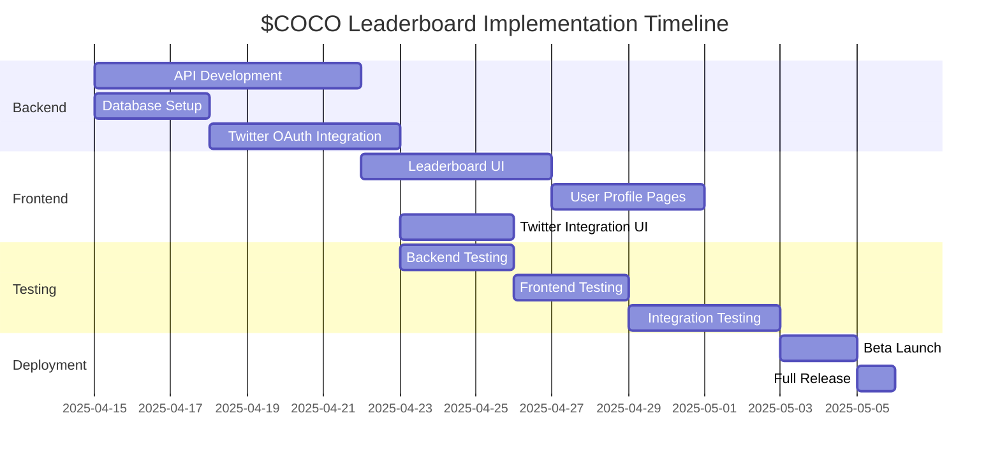

# $COCO Memecoin Website - Detailed Plan

Based on our discussion and the project spec, this document outlines a comprehensive plan for creating a visually stunning and engaging website for the $COCO memecoin. This plan will focus on creating a viral, attention-grabbing site that highlights the DeFi aspects and supports community growth.

## 1. Technical Stack

For the best visual experience while maintaining good performance, we recommend:

- **Frontend**: HTML5, CSS3, JavaScript with modern frameworks
- **Animation Libraries**: GSAP (GreenSock Animation Platform) for complex animations
- **Responsive Design**: Custom CSS with flexible, responsive layouts
- **Wallet Integration**: Web3.js for connecting to Metamask, Core Wallet, etc.
- **Hosting**: Vercel for fast, reliable hosting

## 2. Website Structure

```mermaid
graph TD
    A[Landing Page] --> B[Hero Section]
    A --> C[DeFi Integration Section]
    A --> D[How to Buy Section]
    A --> E[Community & Sticker Campaign]
    A --> F[Presale Information]
    A --> G[Footer]
    A --> H[Meme Gallery]
    
    B --> B1[Animated COCO Character]
    B --> B2[Tagline & Brief Description]
    B --> B3[Call-to-Action Buttons]
    
    C --> C1[Pharaoh Exchange Integration]
    C --> C2[Apex DeFi Loop Strategy]
    C --> C3[Benefits Visualization]
    
    D --> D1[Vertical Step-by-Step Guide]
    D --> D2[Wallet Connection Button]
    
    E --> E1[Leaderboard Preview]
    E --> E2[Sticker Campaign Explanation]
    E --> E3[Community Links]
    
    F --> F1[Countdown Timer]
    F --> F2[Rocket Launch Animation]
    F --> F3[Presale Details]
    F --> F4[COCO Office Image]
    
    G --> G1[Social Media Links]
    G --> G2[Legal Information]
    G --> G3[Powered by Avalanche]
    
    H --> H1[Interactive Image Gallery]
    H --> H2[Image Lightbox]
    H --> H3[Copy/Save Functionality]
```

## 3. Design Elements

### Color Scheme
- **Primary**: Vibrant Pink (#FF1493)
- **Secondary**: Deep Purple (#8A2BE2)
- **Accent**: Jungle Green (#2AAA8A)
- **Background**: Dark gradient from Purple to Black
- **Text**: White and Light Pink for high contrast

### Typography
- **Main Font**: Fredoka Bold 700 (as specified in the project spec)
- **Secondary Font**: A complementary sans-serif for body text

### Visual Elements
- **Background**: Animated particle effects with jungle-themed elements
- **Mascot**: Animated COCO the pink ostrich appearing throughout the site
- **Icons**: Custom-designed, on-brand icons for features and buttons

## 4. Section-by-Section Breakdown

### Hero Section
- **Main Feature**: Large, animated COCO character that reacts to mouse movements
- **Content**: Bold tagline ("The Pink Ostrich of AVAX") with brief, catchy description
- **Animation**: COCO waving, blinking, or performing a signature move
- **CTA Buttons**: "Connect Wallet" and "Join Presale" with hover animations

### DeFi Integration Section
- **Layout**: Split-screen design showcasing Pharaoh and Apex integrations
- **Visuals**: Interactive diagrams showing how the DeFi loop works
- **Animation**: Flow chart animation demonstrating how interaction increases bonus size
- **Content**: Clear explanation of benefits with animated icons
- **Key Integrations**:
  - **Pharaoh.Exchange**: Highlight swaps, LP farming, and voting benefits
  - **ApexDeFi (https://apexdefi.xyz/)**: Showcase ERC314 wrapper, staking, and rev share features

### How to Buy Section
- **Design**: Vertical step-by-step guide with alternating content layout
- **Animation**: Elements animate as they scroll into view
- **Content**: Detailed instructions with visual aids
- **Integration**: Direct wallet connection functionality
- **Key Directions**:
  - **Crypto.com**: Guide for buying AVAX on centralized exchange
  - **Core.App**: Instructions for setting up and using the Core Wallet
  - **Pharaoh.Exchange**: Tutorial for swapping tokens and providing liquidity

### Community & Sticker Campaign
- **Feature**: Preview of the leaderboard system (marked as "Coming Soon")
- **Animation**: Animated stickers appearing and being "placed" virtually
- **Content**: Explanation of how the sticker campaign works
- **Visuals**: Examples of stickers and QR codes
- **Social Media**: Vertical layout of social media links with custom X icon

### Presale Information
- **Centerpiece**: Countdown timer to presale launch
- **Animation**: Rocket launch effect when interacting with presale button
- **Content**: Clear information about presale mechanics
- **Design**: High-contrast section to draw attention
- **Visual**: COCO Office image to enhance visual appeal

### Meme Gallery
- **Layout**: Responsive grid layout of all COCO memes and artwork
- **Interaction**: Clickable images that open in a lightbox view
- **Navigation**: Arrow buttons to browse through images in the lightbox
- **Functionality**: Copy and Save buttons for image sharing
- **Animation**: Hover effects and transitions for gallery items

### Footer
- **Social Links**: Icons for X (Twitter), Telegram, Discord with hover animations
- **Legal**: Minimal necessary legal information
- **Design**: Clean, simple layout with brand colors
- **Branding**: "Powered by Avalanche" logo

## 5. Interactive Elements & Animations

### Key Animations
1. **Rocket Launch Effect**: When users hover over or click the presale button, a rocket with COCO riding it launches upward with a trail of particles
2. **Floating COCO Characters**: Small COCO characters floating across the screen at random intervals
3. **Parallax Scrolling**: Background elements move at different speeds for depth
4. **DeFi Flow Animation**: Animated diagram showing how tokens flow through the ecosystem
5. **Button Animations**: Pulsing, glowing, or morphing effects on important buttons
6. **Loading Animation**: COCO running or spinning while page elements load
7. **Scroll Reveal Animations**: Elements animate as they scroll into view

### Interactive Elements
1. **Wallet Connection**: Seamless integration with popular wallets (especially Core.App)
2. **Hover Effects**: All buttons and clickable elements have distinct hover states
3. **Mobile Interactions**: Touch-optimized elements for mobile users
4. **Easter Eggs**: Hidden interactions that reveal COCO doing funny actions
5. **Gallery Lightbox**: Interactive image viewer with navigation and sharing options

## 6. Mobile Responsiveness

The website is fully responsive with:
- **Mobile-First Approach**: Ensuring perfect display on all devices
- **Optimized Animations**: Simplified animations for mobile to maintain performance
- **Touch-Friendly Elements**: Larger touch targets for mobile users
- **Adaptive Layout**: Content reorganization based on screen size

## 7. Performance Optimization

To ensure the site remains fast despite rich animations:
- **Lazy Loading**: Images and animations load as they enter viewport
- **Image Optimization**: Compressed images without quality loss
- **Code Splitting**: Loading only necessary JavaScript
- **Animation Throttling**: Reducing animation complexity on lower-end devices

## 8. Vercel Deployment

To deploy the website on Vercel:

1. **Configuration**: A vercel.json file has been created with the following settings:
   - Static site configuration
   - Proper routing rules
   - Project name and version

2. **Deployment Steps**:
   - Connect the GitHub repository to Vercel
   - Configure build settings (not required for static sites)
   - Set up custom domain if needed
   - Deploy the site

3. **Advantages of Vercel**:
   - Global CDN for fast loading worldwide
   - Automatic HTTPS
   - Easy preview deployments for testing changes
   - Analytics and performance monitoring

## 9. Leaderboard Integration Plan

### Twitter Integration

1. **Authentication System**:
   - Implement Twitter OAuth for user authentication
   - Allow users to connect their Twitter accounts to their wallet addresses
   - Store user data securely in a database

2. **Leaderboard Functionality**:
   - Track user activity through QR code scans
   - Award points for various actions:
     - Scanning QR codes (5 points)
     - Sharing $COCO content on Twitter (10 points)
     - Referring new users who scan QR codes (15 points)
     - Engaging with $COCO tweets (likes, retweets) (2-5 points)

3. **Backend Requirements**:
   - API endpoints for:
     - User authentication
     - QR code tracking
     - Point calculation and leaderboard ranking
     - Twitter activity verification
   - Database for storing:
     - User profiles (wallet address, Twitter handle)
     - Activity history
     - Points and rankings

4. **Frontend Implementation**:
   - Real-time leaderboard display showing:
     - User ranking
     - Points earned
     - Twitter handle
     - Recent activity
   - User profile page showing:
     - Personal stats
     - QR codes scanned
     - Twitter activity
     - Rewards earned/available

5. **Reward Distribution System**:
   - Automatic calculation of presale allocations based on leaderboard position
   - Tiered reward structure:
     - Top 10: Premium allocation
     - Top 100: Enhanced allocation
     - Top 1000: Standard allocation
   - Smart contract integration for reward distribution

### Implementation Timeline

### Technical Requirements

1. **Server Infrastructure**:
   - Node.js backend with Express
   - MongoDB or PostgreSQL database
   - Redis for caching and real-time updates

2. **Twitter API Integration**:
   - Twitter API v2 for authentication and activity tracking
   - Webhook subscriptions for real-time engagement tracking
   - Rate limit handling and fallback mechanisms

3. **Blockchain Integration**:
   - Web3.js for wallet connections
   - Smart contract for reward distribution
   - Transaction verification system

4. **Security Considerations**:
   - OAuth token security
   - Rate limiting to prevent abuse
   - Anti-fraud measures for QR code scanning
   - Data encryption for user information

## 10. Future Expansion Possibilities

While focusing on the initial landing page, the architecture supports easy addition of:
- Full leaderboard functionality as detailed above
- Token swap interface
- NFT/PFP collection showcase
- Detailed tokenomics page
- Community governance features
- Enhanced meme gallery with user submissions